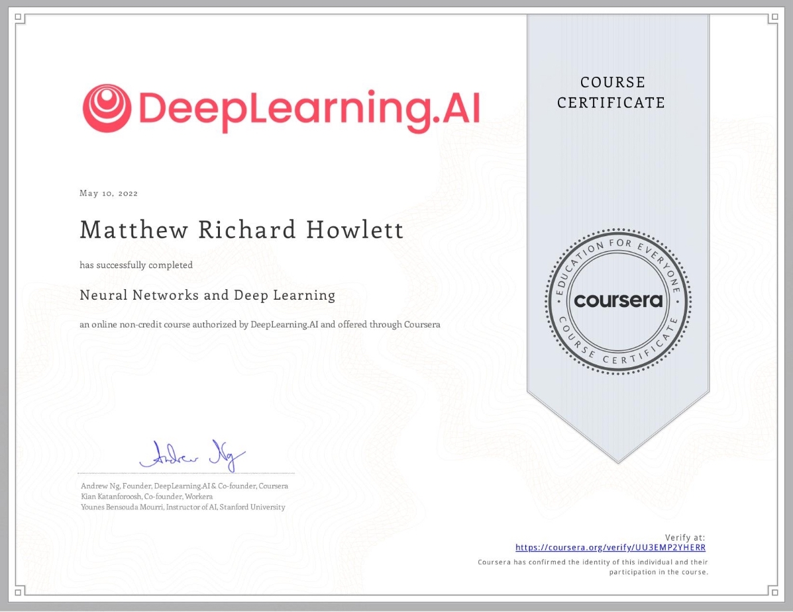

# 🏂 🚵‍♂️ Matthew Howlett

`Research Scientist/Engineer` 
`Michigan Aerospace Corporation`

#

I graduated from University in 2019 with a bachelor's in Engineering Physics. I was drawn to this discipline due to the broad bandwidth of material that would be covered. I had a wide range of interests and feared that choosing a more specialized field would lead to dissatisfaction or regret. During my studies and through my work experience at Michigan Aerospace, I have gained expertise in various areas of engineering, but a love for research and software development formulated. Over the years, I have experience designing and building remote sensors, full-stack web applications, and embedded systems from the initial stages to final product. My goal is to continue my education and become a digital craftsman, and I am pursuing this through various means, including teaching computers to learn deeply.

#

### 🧰 🛠 Languages and Tools

<!-- These are kinda transparent -->
<!-- 
 -->

 
 

#

### 🪪 Licenses & certifications

